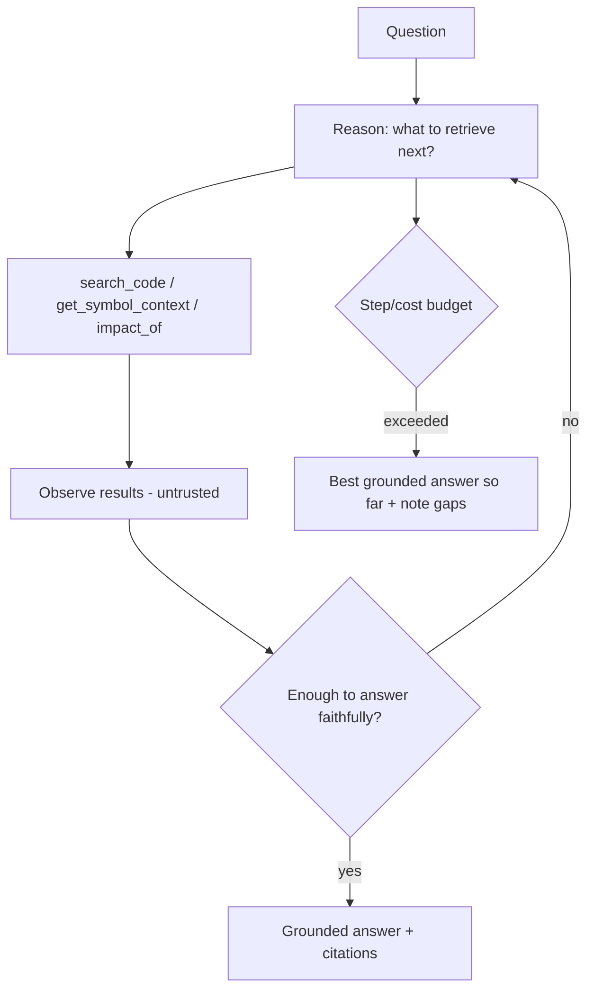
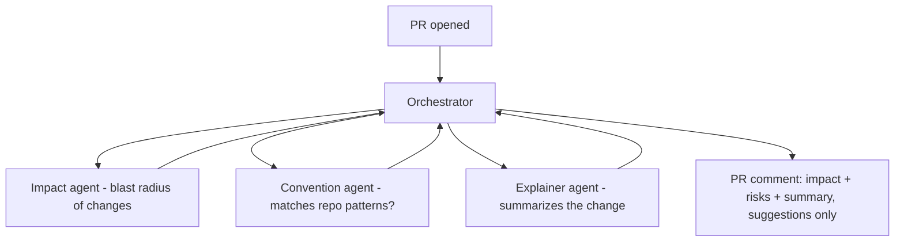

# Codebase Intelligence — AGENT DESIGN

General patterns: AGENT_GUIDE.md. Agents here are **read-only and grounded** — they understand code, they don't change it (changes are HITL/other tools' jobs).

## Single-agent: Codebase Q&A agent (multi-hop)
Most codebase questions are answered by a single RAG call (a workflow). The agent is for **multi-hop** questions ("trace how a request flows from API to DB") that need iterative retrieval + graph traversal.

Tools: `search_code`, `get_symbol_context`, `impact_of`, `get_repo_summary` (all read-only). Budgeted steps; loop detection; always cite; "I don't know" on low confidence.

## Multi-agent: PR review (V2)

Suggest-only (no auto-merge/auto-change); comments are advisory; HITL is the human reviewer.

## Communication
Shared state in Postgres/Redis (observable); structured handoffs with only relevant context; agents-as-MCP-tools for clean boundaries.

## Reliability & guardrails
- Workflows for single-hop Q&A; agent only for multi-hop.
- Read-only tools by default; no code mutation from agents.
- Budgets (steps/tokens/$), loop detection, timeouts.
- Retrieved content/tool output treated as untrusted (injection defense).
- Trajectory tracing + failure taxonomy (reuses Agent Monitoring #4).
- Always grounded + cited; never bluff.

## Frameworks
Thin own orchestration default; LangGraph for the multi-hop graph + PR-review multi-agent; Claude Agent SDK for Claude-native flows. Behind our interfaces (swappable).

## Agents catalog
| Agent | Job | Autonomy |
|-------|-----|----------|
| Codebase Q&A (multi-hop) | Answer complex questions via iterative retrieval | Low (read-only) |
| PR review | Impact + convention + summary comments | Low (suggest only) |
| Onboarding/learning-path | Guide a new dev through the codebase | Low (read-only) |
| Doc generator | Produce/refresh living docs | Low (HITL on publish) |
