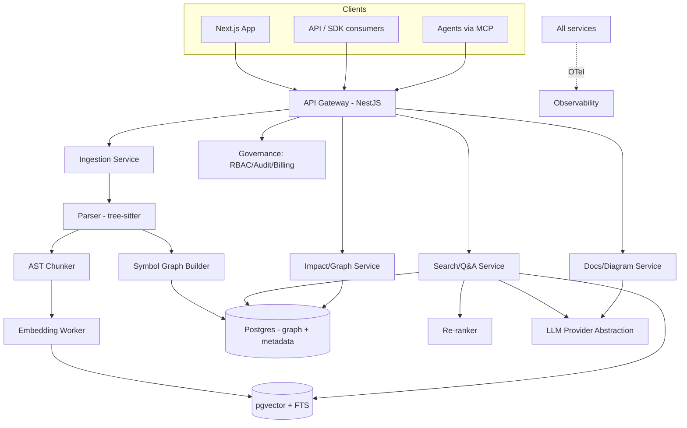
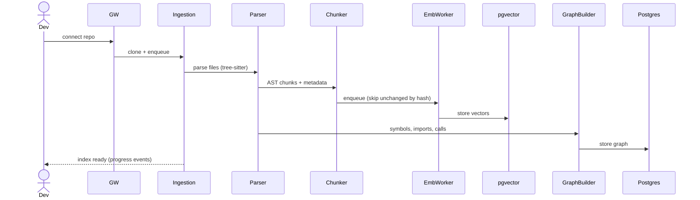
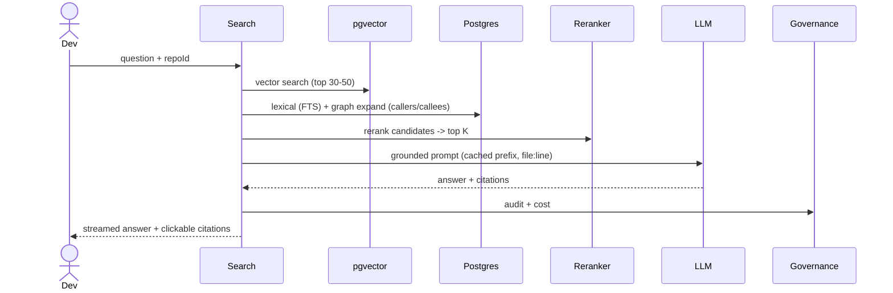

# Codebase Intelligence — ARCHITECTURE

## 1. System architecture

Modular monolith first; heaviest pieces (Ingestion, Embedding workers) extract first under load (D-009).

## 2. Components
| Component | Responsibility | Tech |
|-----------|----------------|------|
| Ingestion | Clone, detect language, parse, chunk, queue embeddings, build graph | NestJS + tree-sitter + BullMQ |
| Embedding Worker | Embed chunks (code + NL summary), content-hash cache | Worker + `packages/llm` |
| Search/Q&A | Hybrid retrieve + graph expand + rerank + grounded generate | NestJS + pgvector + FTS |
| Docs/Diagram | Generate living docs + Mermaid architecture from graph | NestJS + LLM |
| Impact/Graph | Symbol graph queries, callers/callees, blast radius | NestJS + Postgres (recursive CTEs / graph) |
| Governance | RBAC, audit, billing, spend caps | NestJS + Postgres + Stripe |

## 3. Service boundaries
- **Ingestion vs. Search:** write path (heavy, async) vs. read path (latency-sensitive). Clean seam to scale independently.
- **Graph as first-class:** the symbol/dependency graph is separate from vectors — powers impact analysis + graph-RAG.
- **Engine exposed via API/MCP:** Search/Q&A + Impact are the public product surface (this is how #1 and #6 consume it).

## 4. Data flow — index a repo

## 5. Data flow — answer a question

## 6. Event flow
`repo.connected` → index job. `repo.pushed` (webhook) → incremental reindex (changed files) + doc-drift check. `index.completed` → generate/refresh summary + docs. `query.answered` → sample into evals. Redis streams/BullMQ.

## 7. Multi-tenancy
Tenant = org. `org_id` + RLS; vector queries always `org_id`-filtered; per-repo isolation. (See [DATABASE.md](./DATABASE.md), [SECURITY.md](./SECURITY.md).)

## 8. Scaling path
Monolith → extract Ingestion+Embedding workers → shard vectors by tenant/repo → dedicated vector store at threshold (D-004) → K8s for enterprise/VPC.

## 9. NFRs
Index 100k LOC < 10 min; incremental reindex < 1 min for small pushes; answer first-token < 1.5s, p95 < 4s; 99.9% uptime (V3). Every answer cited + costed.
