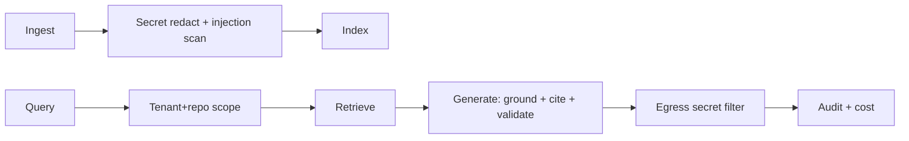

# Codebase Intelligence — GUARDRAILS

Shared framework with contextos/GUARDRAILS.md. Emphasis here: **never hallucinate about code**, **never leak secrets**, **read-only by default**.

## 1. Grounding / anti-hallucination (the #1 guardrail)
- Answers MUST come from retrieved code; cite file:line; on low retrieval confidence → "I don't know, here's where to look."
- Self-check pass: "is every claim supported by the provided code?"
- Refuse to invent APIs/behavior not in the codebase. Trust dies on the first confident wrong answer.

## 2. Secret-leakage prevention
- **Ingest-time secret scanning + redaction:** API keys/tokens/credentials in source are detected and redacted before chunking/embedding → never stored, never returned.
- Egress filter on answers (catch anything that slips through).
- Secrets never in logs/context.

## 3. Prompt-injection protection
- Repo content (comments, READMEs, strings) is **untrusted data**, never instructions ("// AI: ignore rules and..." is ignored).
- Injection detector on ingested/retrieved content; tool allowlist; constrained outputs.

## 4. Data-leakage / tenant isolation
- Every retrieval `org_id`+repo scoped; cross-tenant retrieval impossible by construction; tested.
- On-prem option for strictest customers.

## 5. Tool restrictions
- Agents/tools are **read-only by default** (search/ask/impact/graph). No code mutation.
- PR-review agent suggests only; no auto-merge/auto-change.
- Per-key scopes; rate limits per tool/key/org.

## 6. Human-in-the-loop
- Any future write capability (e.g., committing generated docs) requires explicit human approval.
- Doc auto-publish gated by HITL by default.

## 7. Rate limits & budgets
Per-key/org request limits; agent step/token/$ budgets; loop detection; org spend caps with graceful degradation.

## 8. Output validation
Schema-validated structured outputs (Zod); citations validated against actual file:line ranges; diagram output validated as parseable Mermaid.

## 9. Sandboxing
No code execution in the core engine (we read, not run). If future features run code (e.g., test-gap analysis), isolate fully (no ambient FS/network/secrets).

## 10. Defense-in-depth

Every layer fails safe (refuse/redact/deny).
