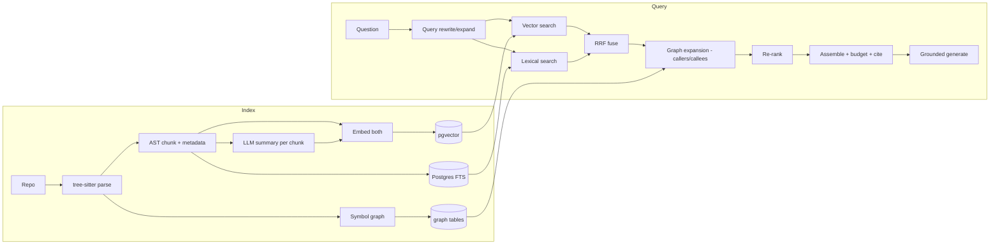

# Codebase Intelligence — RAG

The flagship RAG-over-code implementation. This is the moat. General method: RAG_GUIDE.md. This doc is the product-specific spec.

## Pipeline

## Chunking (highest leverage)
- **AST-aware** via tree-sitter: split by function/class/module. Each chunk = a semantically whole unit.
- Metadata: `repo_id, path, language, symbol, kind, start_line, end_line, imports, callers, callees, git_last_modified`.
- Oversized functions: overlap-split, repeat signature/docstring in each piece.
- Index non-code too: READMEs, ADRs, comments, commit messages, PR descriptions (recursive chunking).

## Embedding
Dual: raw code + LLM NL summary. Store both vectors (or summary as searchable text + code vector). Content-hash cache; incremental on push.

## Retrieval
- **Vector** (HNSW cosine) for meaning + **lexical** (Postgres FTS / trigram) for identifiers/error strings → **RRF fusion**.
- **Scope filters:** repo, path, language, recency. **Tenant filter `org_id` mandatory.**
- Pull top ~30–50 candidates for the reranker.

## Graph expansion (graph RAG)
For matched symbols, pull related nodes (callers/callees/imports) from the symbol graph so cross-file logic is in context. Essential for "how does X flow through the system?" questions that pure vector search misses.

## Re-ranking
Cross-encoder or LLM scoring reorders candidates by true relevance → top K (5–10) within token budget. Biggest precision win after chunking.

## Assembly
Order by relevance; file:line headers for citations; dedupe; respect token budget (few high-quality chunks beat many). Stable system prompt cached.

## Generation
"Answer ONLY from provided code. Cite file:line. If not present, say you don't know." Low temperature. Force citations. Optional self-check pass for faithfulness.

## Advanced (adopt per eval gaps)
Query rewriting/expansion (conversational follow-ups), multi-query (recall-critical), HyDE (vague queries), agentic RAG (multi-hop via the Q&A agent), contextual retrieval (situate chunks before embedding).

## Evaluation
Golden Q&A over known repos: retrieval recall@k/precision@k/MRR; faithfulness; citation correctness; latency p95; cost-per-query. LLM-as-judge + deterministic citation checks. CI gate; production sampling grows dataset. Eval scores published for trust.

## Freshness & scale
Webhook → incremental reindex (changed files only, content-hash). Index tied to commit SHA. Partition vectors by tenant/repo; HNSW tuning; dedicated vector DB at threshold (D-004).

## Tenant isolation
Every retrieval query filtered by `org_id` + repo scope. Tested. No cross-tenant retrieval, ever.
