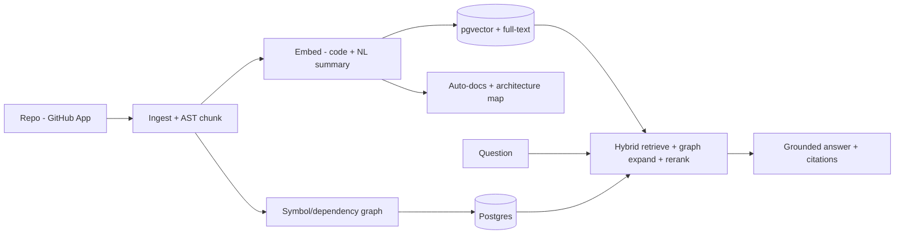

# Codebase Intelligence Platform

> **Deep, queryable understanding of any codebase.** Ask questions, get grounded answers with citations; auto-generated living docs; impact/blast-radius analysis; onboarding acceleration — exposed as an API and an MCP server so any tool or agent can use it.

**Project #2 (Core engine)** · Priority ⭐⭐⭐ · Difficulty: High · Time-to-MVP: 2–3 months

---

## About this repository

This is **Codebase Intelligence (project #2)**, extracted from a larger "AI Startup Lab." The docs at the repo root are the product spec/vision; references to sibling pieces (`ContextOS`, `DECISION_LOG`, the `*_GUIDE` files) point to that broader context and aren't part of this standalone repo.

**The working engine is in [`engine/`](./engine)** — a real, evaluated RAG-over-code pipeline (ingest → chunk → embed → hybrid retrieve → re-rank → import-graph → cite/answer), pure TypeScript, **zero-network by default** (real embedding/LLM APIs swap in for production). Try it:
```bash
cd engine
node scripts/demo.ts        # index this engine's own source + ask it questions
node scripts/eval.ts        # retrieval quality (recall@k, MRR) — hybrid vs +re-ranker
```
Current eval (local-embeddings baseline, on the engine's own source): **recall@3 = 100%, MRR 0.818 → 0.864** with the re-ranker. See [`engine/README.md`](./engine/README.md).

Licensed under **Apache-2.0** — see [LICENSE](./LICENSE).

---

## What we're building
A platform that ingests a codebase and builds a rich, retrievable understanding of it: semantic + lexical search, grounded Q&A ("how does auth work here?"), automatically maintained documentation and architecture maps, and impact analysis ("what breaks if I change this function?"). It's the **RAG-over-code engine** — the hardest, most defensible piece of the whole lab, reused by ContextOS (#1) and System Design Assistant (#6).

## Why we're building it
- "Talk to your codebase" is validated, hot demand (2026) but most tools are shallow — naive chunking, weak cross-file reasoning, no governance.
- It's the **technical center of gravity**: master RAG-over-code once, power three products.
- Onboarding, code understanding, and impact analysis are universal, expensive pains.

## Who it's for
Engineering teams with large/legacy/polyrepo codebases; new hires; agencies onboarding to client code; any AI agent needing to understand code. See [CUSTOMERS.md](./CUSTOMERS.md).

## How it works


## Core capabilities (maturity ladder)
| Stage | Capability |
|-------|-----------|
| **MVP** | Connect repo, index, semantic+keyword code search, grounded Q&A with file:line citations, auto repo summary |
| **V1** | Teams/RBAC, living auto-docs, architecture diagrams, multi-repo, search/reporting, impact analysis |
| **V2** | Agents (codebase Q&A agent, PR review), MCP server, automation, enterprise controls |
| **V3** | On-prem/VPC, SSO, advanced governance, org-wide knowledge graph |

Full inventory: [FEATURES.md](./FEATURES.md).

## Document map
[VISION](./VISION.md) · [PROBLEM](./PROBLEM.md) · [CUSTOMERS](./CUSTOMERS.md) · [FEATURES](./FEATURES.md) · [USER_STORIES](./USER_STORIES.md) · [ARCHITECTURE](./ARCHITECTURE.md) · [TECH_STACK](./TECH_STACK.md) · [DATABASE](./DATABASE.md) · [API_DESIGN](./API_DESIGN.md) · [AI_ARCHITECTURE](./AI_ARCHITECTURE.md) · [RAG](./RAG.md) · [MCP](./MCP.md) · [AGENT_DESIGN](./AGENT_DESIGN.md) · [SECURITY](./SECURITY.md) · [OBSERVABILITY](./OBSERVABILITY.md) · [GUARDRAILS](./GUARDRAILS.md) · [DEVOPS](./DEVOPS.md) · [TASKS](./TASKS.md) · [SPRINTS](./SPRINTS.md) · [PRICING](./PRICING.md) · [GTM](./GTM.md) · [SALES](./SALES.md) · [RISKS](./RISKS.md) · [HIRING](./HIRING.md) · [OPEN_SOURCE](./OPEN_SOURCE.md) · [RESUME_VALUE](./RESUME_VALUE.md) · [CLAUDE.md](./CLAUDE.md) · [AGENTS.md](./AGENTS.md) · [llms.txt](./llms.txt) · [mcp.json](./mcp.json)

## One-liner
> Codebase Intelligence is the brain that actually understands your code — searchable, explainable, and queryable by humans and agents alike.

*Build #2 in the wedge (after #3, before #1). It is the moat. See START_HERE.md.*
